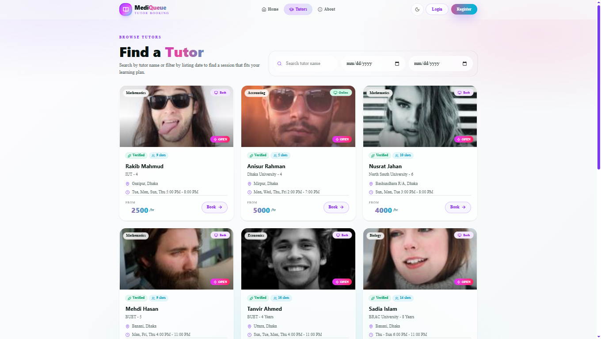
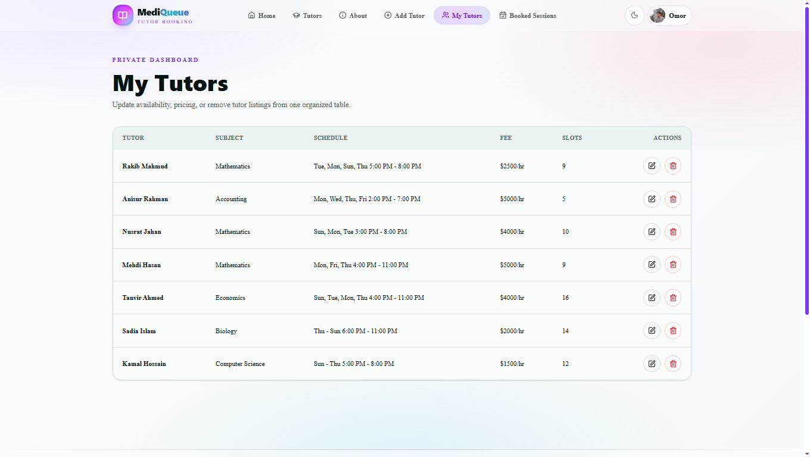

<div align="center">

# MediQueue Tutor

### The Premium Platform for Academic Excellence

A polished full-stack tutor booking platform where students can find verified tutors, book sessions, manage their learning journey, and where tutors can offer their expertise.

[](https://mediqueuetutor.vercel.app/)
[](https://nextjs.org/)
[](https://react.dev/)
[](https://tailwindcss.com/)
[](https://www.mongodb.com/)
[](https://mediqueuetutor.vercel.app/)

</div>

---

## 📸 Preview

<p align="center">
  
  
  
</p>

> **🔗 Live Site:** [https://mediqueuetutor.vercel.app/](https://mediqueuetutor.vercel.app/)
> **⚙️ Server API:** [https://mediqueuetutorserver.vercel.app/](https://mediqueuetutorserver.vercel.app/)
> **💻 Server Repo:** [https://github.com/smRid/MediQueue-Tutor-Server](https://github.com/smRid/MediQueue-Tutor-Server)

---

## ✨ Features

| Feature                         | Description                                                                                  |
| :------------------------------ | :------------------------------------------------------------------------------------------- |
| 🧭 **Tutor Discovery**          | Browse, filter, and search for verified expert tutors across 30+ subjects                    |
| 📅 **Session Booking**          | Seamlessly book online or offline sessions at your convenience                               |
| 👨‍🏫 **Tutor Dashboard**          | Tutors can manage their profiles, add their subjects, and track their booked sessions        |
| 👥 **User Profiles**            | Dedicated profiles to track learning progress and view past or upcoming sessions             |
| 🔐 **Authentication Gate**      | Better-auth powered sign-in protects user routes and securely manages sessions               |
| 🌓 **Light/Dark Theme**         | Toggle between clean light and dark visually rich themes                                     |
| 📱 **Responsive UI**            | Responsive layouts optimized for desktop, tablet, mobile, and large screens                  |
| 🚀 **Performance Optimized**    | Built on Next.js App Router for optimal page loading speeds and SEO                          |

---

## 🛠️ Tech Stack

<div align="center">

|        Technology         |                              Purpose                               |
| :-----------------------: | :----------------------------------------------------------------: |
|       **Next.js 16**      |          React framework for server-side rendering and routing     |
|       **React 19**        |                    Component-driven frontend UI                    |
|     **Tailwind CSS 4**    |             Utility-first responsive application styling           |
|      **Better-Auth**      |          Authentication, sessions, users, and social logins        |
|        **MongoDB**        |             NoSQL database for flexible data modeling              |
|        **Express**        |                         Backend API server                         |
|   **React Hot Toast**     |            User feedback for saves, errors, and actions            |
|     **Lucide React**      |             Consistent icon system across the workspace            |
|       **DaisyUI**         |              Component library for rapid UI development            |
|       **Vercel**          |                  Frontend and backend deployment                   |

</div>

---

## 📁 Project Structure

```text
MediQueue-Tutor/
├── public/
│   ├── preview1.png
│   ├── preview2.png
│   └── preview3.png
├── src/
│   ├── app/
│   │   ├── about/
│   │   ├── add-tutor/
│   │   ├── login/
│   │   ├── my-booked-sessions/
│   │   ├── my-profile/
│   │   ├── my-tutors/
│   │   ├── register/
│   │   ├── tutors/
│   │   ├── layout.jsx
│   │   └── page.jsx
│   ├── components/
│   │   ├── heroSection/
│   │   ├── navbar/
│   │   └── ...
│   ├── context/
│   │   └── ThemeContext.jsx
│   ├── lib/
│   │   ├── api.js
│   │   ├── auth.jsx
│   │   └── auth-client.jsx
├── package.json
└── README.md
```

---

## 🎨 Design Highlights

- **MediQueue landing page** with a polished hero section, marquee showcases, and animated CTA bands
- **Dynamic User Dashboard** focused on learning and tutor management with clear statistics
- **Responsive navigation** that adapts seamlessly from mobile hamburger menus to desktop navigation bars
- **Modern aesthetics** using glassmorphism, subtle gradients, and customized Tailwind styling
- **Consistent interaction language** using lucide icons, animated buttons, and toast feedback
- **Authenticated app shell** that conditionally renders navigation items based on user login state

---

## 🔐 Environment Variables

Create a `.env` file in the project root and configure these values:

```env
# MongoDB Atlas
MONGODB_URI=your_mongodb_connection_string
MONGODB_DB=mediqueue

# App URLs
NEXT_PUBLIC_APP_URL=http://localhost:3000
NEXT_PUBLIC_API_BASE_URL=http://localhost:5000

# Better Auth
BETTER_AUTH_SECRET=your_random_secret
BETTER_AUTH_URL=http://localhost:3000

# Google OAuth
GOOGLE_CLIENT_ID=your_google_oauth_client_id
GOOGLE_CLIENT_SECRET=your_google_oauth_client_secret

# JWT
JWT_SECRET=your_jwt_secret
```

For production, set:

```env
BETTER_AUTH_URL=https://mediqueuetutor.vercel.app
NEXT_PUBLIC_APP_URL=https://mediqueuetutor.vercel.app
NEXT_PUBLIC_API_BASE_URL=https://mediqueuetutorserver.vercel.app
```

---

## 🚀 Getting Started

Install dependencies:

```bash
npm install
```

Run the development server:

```bash
npm run dev
```

Open the app:

```text
http://localhost:3000
```

Build for production:

```bash
npm run build
```

Run the production server:

```bash
npm start
```

---

## 🌐 Deployment

The application is deployed on **Vercel**:

**Frontend Live URL:** [https://mediqueuetutor.vercel.app/](https://mediqueuetutor.vercel.app/)
**Backend Live URL:** [https://mediqueuetutorserver.vercel.app/](https://mediqueuetutorserver.vercel.app/)
**Backend Repository:** [https://github.com/smRid/MediQueue-Tutor-Server](https://github.com/smRid/MediQueue-Tutor-Server)

For deployment:

1. Add all production environment variables in Vercel project settings.
2. Set `BETTER_AUTH_URL` to `https://mediqueuetutor.vercel.app`.
3. Set `NEXT_PUBLIC_APP_URL` to `https://mediqueuetutor.vercel.app`.
4. Set `NEXT_PUBLIC_API_BASE_URL` to `https://mediqueuetutorserver.vercel.app`.
5. Configure Google OAuth authorized origins and redirect URLs for the production domain.
6. Allow Vercel/production access in MongoDB Atlas Network Access.
7. Redeploy after changing environment variables.

---

<div align="center">

**⭐ If you found this project useful, consider giving it a star!**

Made with ❤️ using Next.js, React, Tailwind CSS, Better-Auth, MongoDB, and Vercel

</div>
